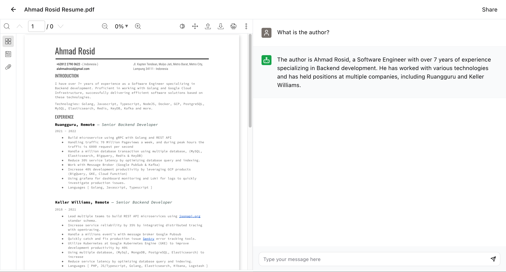

## PDFPINTAR



## Required ENV

```bash
APP_NAME=
APP_ENV=
APP_KEY=base64:wx+...
APP_DEBUG=
APP_URL=http://localhost:8000

HOME_DIR=/var/www/pdfpintar

OPENAI_API_KEY=

DB_CONNECTION=pgsql
DB_HOST=127.0.0.1
DB_PORT=5432
DB_DATABASE=
DB_USERNAME=
DB_PASSWORD=
```

## Setup Postgresql

```sql
CREATE USER pdfpintar WITH PASSWORD 'password';
CREATE DATABASE pdfpintar OWNER pdfpintar;
ALTER USER pdfpintar WITH SUPERUSER;
```

## Install Pgvector extensions

```bash
sudo apt-get install postgresql-server-dev-14 postgresql-contrib libpq-dev gcc make -y
sudo apt-get install php8.1-pgsql php8.1-dom php8.1-curl php8.1-zip php8.1-redis
cd /tmp
git clone --branch v0.4.2 https://github.com/pgvector/pgvector.git
cd pgvector
make clean && PG_CFLAGS=-DIVFFLAT_BENCH make && make install
```

## Build project

Install nodejs.

```bash
curl -fsSL https://deb.nodesource.com/setup_18.x | sudo -E bash -
sudo apt install -y nodejs
curl -fsSL https://get.pnpm.io/install.sh | sh -
```

Install and build nodejs package.

```bash
pnpm install
pnpm build
```

## Nginx Config

Install php fpm:

```bash
sudo apt install php8.1-fpm
```

Setup nginx config:

```bash
server {
    server_name pdfpintar.ahmadrosid.com;
    root /var/www/pdfpintar/public;

    add_header X-Frame-Options "SAMEORIGIN";
    add_header X-Content-Type-Options "nosniff";
    add_header X-XSS-Protection "1; mode=block";

    index index.php;

    charset utf-8;

    location / {
        try_files $uri $uri/ /index.php?$query_string;
    }

    location = /favicon.ico { access_log off; log_not_found off; }
    location = /robots.txt  { access_log off; log_not_found off; }

    error_page 404 /index.php;

    location ~ \.php$ {
        fastcgi_pass unix:/var/run/php/php8.1-fpm.sock;
        fastcgi_index index.php;
        fastcgi_param SCRIPT_FILENAME $realpath_root$fastcgi_script_name;
        include fastcgi_params;
    }

    location ^~ /document/chat/streaming$ {
        proxy_http_version 1.1;
        add_header Connection '';

        fastcgi_pass unix:/var/run/php/php8.1-fpm.sock;
        fastcgi_index index.php;
        fastcgi_param SCRIPT_FILENAME $realpath_root$fastcgi_script_name;
        include fastcgi_params;
    }

    location ~ /\.(?!well-known).* {
        deny all;
    }

    listen [::]:443 ssl ipv6only=on; # managed by Certbot
    listen 443 ssl; # managed by Certbot
    ssl_certificate /etc/letsencrypt/live/pdfpintar.ahmadrosid.com/fullchain.pem; # managed by Certbot
    ssl_certificate_key /etc/letsencrypt/live/pdfpintar.ahmadrosid.com/privkey.pem; # managed by Certbot
    include /etc/letsencrypt/options-ssl-nginx.conf; # managed by Certbot
    ssl_dhparam /etc/letsencrypt/ssl-dhparams.pem; # managed by Certbot
}
```

Add permission to project directory:

```bash
sudo chown -R www-data:www-data storage bootstrap/cache
sudo chmod -R 775 storage bootstrap/cache
sudo systemctl restart php8.1-fpm
sudo systemctl restart nginx
```

## Queue Worker

Install supervisor

```bash
bash apt install supervisor
```

Add new worker config.

```bash
cd /etc/supervisor/conf.d
vim queue-worker.conf
```

Point config value to the destination project folder.

```yaml
[program:queue-worker]
process_name = %(program_name)s_%(process_num)02d
command=php /var/www/pdfpintar/artisan queue:listen
autostart=true
autorestart=true
user=root
numprocs=1
redirect_stderr=true
stdout_logfile=/var/www/pdfpintar/storage/logs/worker.log
```

Update supervisorctl config

```bash
sudo supervisorctl reread
sudo supervisorctl update
sudo supervisorctl restart all
```
